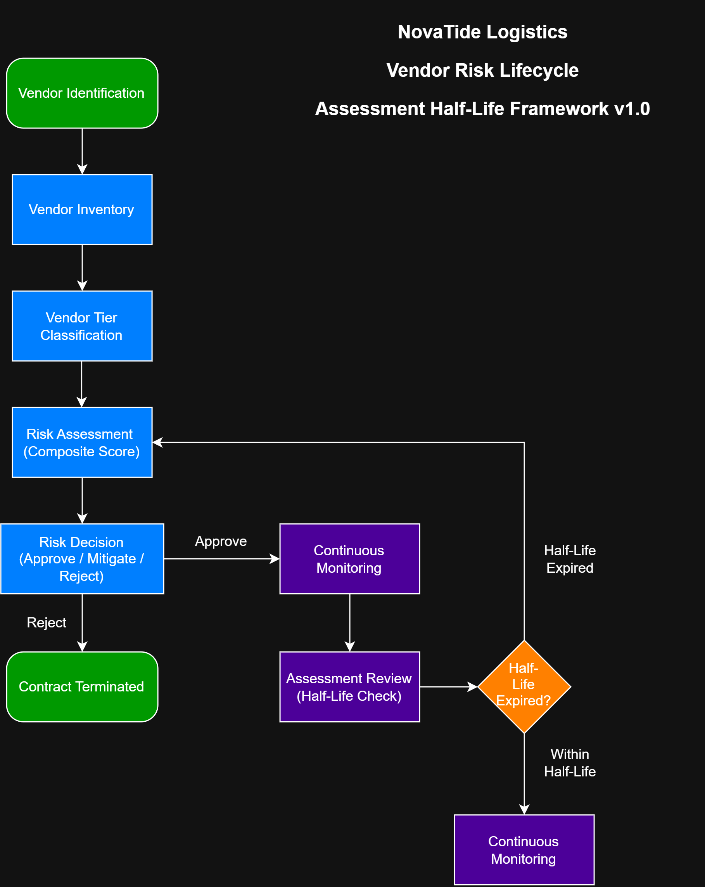
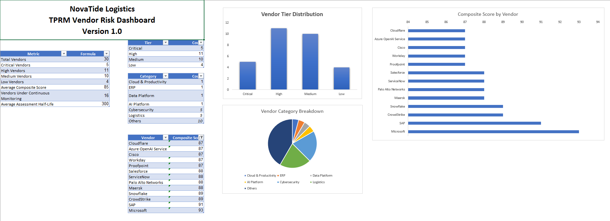

# NovaTide Logistics Enterprise Simulation

# TPRM Vendor Scoring Framework: Assessment Half-Life Toolkit

  

A practical Third-Party Risk Management (TPRM) toolkit that demonstrates how organizations can evolve from **point-in-time vendor assessments** to **continuous, risk-based vendor monitoring** using the concept of **Assessment Half-Life**.

This repository operationalizes concepts discussed in my LinkedIn article:

**"Your Vendor Assessment Has a Half-Life: What the 2026 Black Kite Report Reveals About Modern TPRM."**

The project is built around the fictional enterprise **NovaTide Logistics**, which serves as a persistent business environment for demonstrating Governance, Risk & Compliance (GRC) concepts through realistic enterprise simulations.

---

# Project Objective

Traditional TPRM programs often assess vendors during onboarding and revisit them annually. However, modern cyber threats evolve much faster than annual assessment cycles.

This toolkit demonstrates how organizations can:

- Build a structured vendor inventory.
- Classify vendors using a risk-based tiering methodology.
- Calculate composite vendor risk scores.
- Apply the concept of **Assessment Half-Life** to determine when vendor assessments should be revisited.
- Support continuous monitoring based on vendor criticality.
- Establish a repeatable and auditable vendor governance process.

---

# Related Resources

## LinkedIn Article

**Your Vendor Assessment Has a Half-Life: What the 2026 Black Kite Report Reveals About Modern TPRM**

🔗 [https://www.linkedin.com/...](https://www.linkedin.com/pulse/when-does-vendor-assessment-stop-being-trustworthy-samyak-jain-c92qf)

---

## Enterprise Simulation

This repository is part of the **NovaTide Logistics Enterprise Simulation**, a portfolio of practical Governance, Risk & Compliance (GRC) projects that explore how cybersecurity, AI governance, third-party risk management, and enterprise risk concepts can be operationalized within a consistent fictional enterprise.

Each implementation is designed to complement selected research and thought leadership where practical demonstration adds value.

---

# Assessment Half-Life

Assessment Half-Life is the central concept introduced in this project.

Rather than assuming a vendor assessment remains valid until the next scheduled review, the framework recognizes that assessment confidence naturally declines over time as vendor environments, threat landscapes, and business dependencies evolve.

The framework recommends reassessment frequencies based on vendor criticality.

| Vendor Tier | Recommended Assessment Half-Life |
|-------------|---------------------------------:|
| Critical | 90 Days |
| High | 180 Days |
| Medium | 365 Days |
| Low | 730 Days |

---

# Repository Contents

| Folder | Description |
|---------|-------------|
| **docs/** | Methodology, scoring model, implementation guide, and monitoring playbook |
| **data/** | Vendor inventory workbook, CSV dataset, and dashboard |
| **diagrams/** | Vendor risk lifecycle workflow and editable Draw.io source |

---

# Dashboard Preview

  

The Excel dashboard provides:

- Vendor inventory summary
- Vendor tier distribution
- Vendor category distribution
- Composite vendor risk rankings
- Continuous monitoring metrics

---

# Vendor Risk Lifecycle

  

The workflow illustrates how vendor assessments transition from onboarding activities to continuous monitoring and periodic reassessment using the Assessment Half-Life methodology.

---

# Who This Project Is For

This repository is intended for:

- Governance, Risk & Compliance (GRC) professionals
- Third-Party Risk Management (TPRM) practitioners
- Cybersecurity Risk and Compliance teams
- Internal Audit professionals
- Students and professionals building practical governance skills

---

# About the Enterprise Simulation

**NovaTide Logistics** is a fictional global logistics company used across my GitHub portfolio to demonstrate realistic implementations of cybersecurity governance, AI governance, enterprise risk management, and third-party risk management.

Rather than creating isolated examples, each repository builds upon the same enterprise environment to simulate how governance programs evolve within a real organization.

---

# Disclaimer

This project is intended for educational and portfolio purposes. All organizations, datasets, scenarios, assessments, and implementation examples are fictional or derived from publicly available information. This repository is designed to demonstrate governance concepts and should not be interpreted as production-ready implementation guidance or legal advice.
